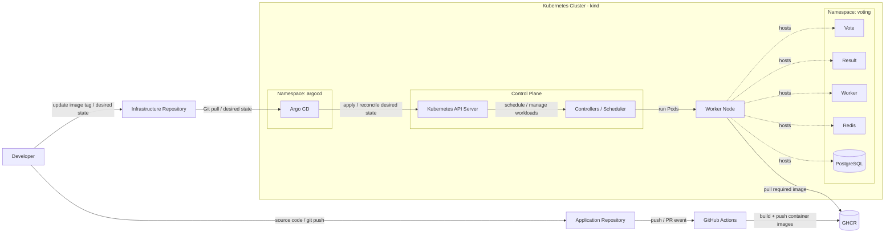
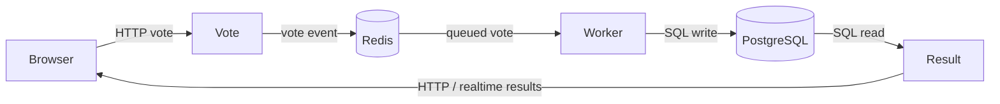

# DevOps Voting App - GitOps Infrastructure

This repository contains the Kubernetes, Helm and GitOps configuration for the Voting App project.

The application code lives in a separate repository. GitHub Actions builds the application images and pushes them to GitHub Container Registry (GHCR). This repository defines which image versions should run in Kubernetes.

Argo CD watches this repository and keeps the cluster aligned with the desired state stored in Git.

## Architecture

The project is easier to understand when the deployment flow and the application runtime flow are shown separately.

### 1. Platform / Deployment Architecture



### What each arrow means

- `Developer → Application Repository` — application source code is pushed to Git.
- `Application Repository → GitHub Actions` — a push or pull request triggers CI.
- `GitHub Actions → GHCR` — CI builds container images and pushes them to the registry.
- `Developer → Infrastructure Repository` — the desired image tag and deployment configuration are updated.
- `Infrastructure Repository → Argo CD` — Argo CD reads the desired state from Git.
- `Argo CD → Kubernetes API Server` — Argo CD applies and reconciles Kubernetes resources.
- `Control Plane → Worker Node` — Kubernetes schedules and manages the workloads.
- `Worker Node → GHCR` — the container runtime pulls the image required by the Pod.

> Important: GHCR does not push images into Kubernetes. Kubernetes pulls the required images from GHCR.

## 2. Application Runtime Flow



This diagram describes the application itself after the Pods are already running.

The Vote service receives the user's choice and writes it to Redis. The Worker processes the vote and stores it in PostgreSQL. The Result service reads the stored data and presents the current results to the user.

## GitOps Flow

The current deployment flow is:

```text
Application change
        ↓
GitHub Actions
        ↓
New image in GHCR
        ↓
Update image tag in the infrastructure repository
        ↓
Argo CD detects the Git change
        ↓
Argo CD reconciles Kubernetes
        ↓
Kubernetes pulls the new image from GHCR
        ↓
New Pods become ready
```

The image-tag update in the infrastructure repository is currently a manual step. Automating that step is intentionally left for the extended lab.

## GitOps Behavior

Argo CD is configured with automated synchronization:

- **Auto-Sync** — changes merged into the infrastructure repository are automatically applied to Kubernetes.
- **Self-Heal** — manual drift in the cluster is corrected so the cluster matches Git again.
- **Prune** — resources removed from Git can also be removed from Kubernetes.

Git is the source of truth for the Kubernetes desired state.

## Main Components

- Docker
- Docker Compose
- Kubernetes
- kind
- Helm
- GitHub Actions
- GitHub Container Registry
- Argo CD

## Repository Structure

```text
.
├── .github/
│   └── workflows/
├── argocd/
│   └── applications/
├── clusters/
│   └── kind/
├── helm/
│   └── voting-app/
└── k8s/
    └── base/
```

## Useful Checks

```bash
kubectl get nodes
kubectl get pods -n voting
kubectl get applications -n argocd
```

## Project Goal

The goal of this project is to demonstrate a clean end-to-end DevOps workflow:

```text
Source Code
→ CI
→ Container Registry
→ GitOps
→ Kubernetes
```

The application repository builds the images. The infrastructure repository defines what should run. Argo CD keeps Kubernetes aligned with Git.
