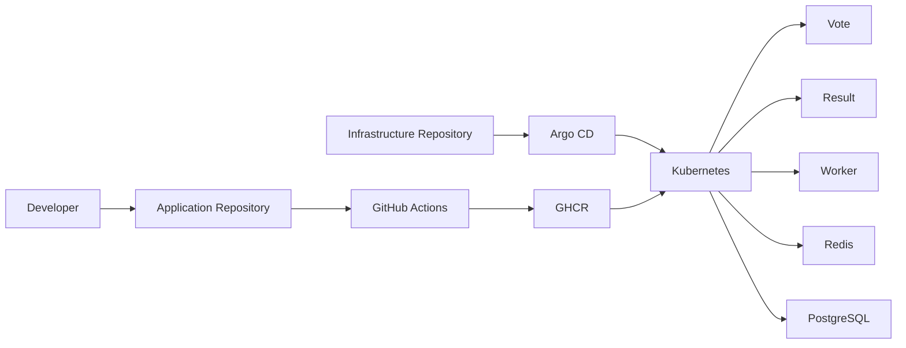

# DevOps Voting App - GitOps Infrastructure

This repository contains the infrastructure and GitOps configuration for the Voting App project.

The project started with Docker Compose for local development and was gradually moved to Kubernetes.

The application images are built in a separate application repository using GitHub Actions and pushed to GitHub Container Registry (GHCR).

This repository defines how those images are deployed.

## Architecture



## Deployment Flow

The deployment flow is simple:

1. Application code is pushed to the application repository.
2. GitHub Actions builds Docker images.
3. Images are pushed to GHCR.
4. The infrastructure repository defines which image version should run.
5. Argo CD watches this repository.
6. Argo CD keeps the Kubernetes cluster synchronized with Git.

Git is the source of truth for the Kubernetes environment.

## Main Components

- Docker
- Docker Compose
- Kubernetes
- Helm
- GitHub Actions
- GitHub Container Registry
- Argo CD
- kind

## Repository Structure

```text
.
├── argocd/
│   └── applications/
├── clusters/
│   └── kind/
├── helm/
│   └── voting-app/
├── k8s/
│   └── base/
└── .github/
    └── workflows/
```

## GitOps Behavior

Argo CD is configured with automated synchronization.

This means:

- Changes merged into Git are automatically applied to Kubernetes.
- Manual changes in the cluster are corrected by Argo CD using self-heal.
- Resources removed from Git can be removed from the cluster using prune.

## Local Kubernetes Cluster

The project uses kind for the local Kubernetes cluster.

Useful commands:

```bash
kubectl get nodes
kubectl get pods -n voting
kubectl get applications -n argocd
```

## Project Goal

The goal of this project is to demonstrate a clean end-to-end DevOps workflow:

```text
Code
→ CI
→ Container Registry
→ GitOps
→ Kubernetes
```

## Repositories

Application repository:
`microservices-app-code`

Infrastructure / GitOps repository:
`microservices-infra-gitops`

The application repository contains the source code, Dockerfiles and Docker Compose setup.

The infrastructure repository contains the Kubernetes manifests, Helm chart, Argo CD configuration and infrastructure validation workflow.

## Runtime Flow

The application itself follows this flow:

```text
Browser
  ↓
Vote
  ↓
Redis
  ↓
Worker
  ↓
PostgreSQL
  ↓
Result
  ↓
Browser
```

## CI/CD and GitOps Flow

```text
Application Repository
        ↓
GitHub Actions
        ↓
GHCR
        ↓
Infrastructure Repository
        ↓
Argo CD
        ↓
Kubernetes
```

GitHub Actions builds the application images.

The infrastructure repository decides which image tag should run.

Argo CD reads the infrastructure repository and keeps the Kubernetes cluster aligned with Git.

Kubernetes pulls the selected image from GHCR and runs it.
